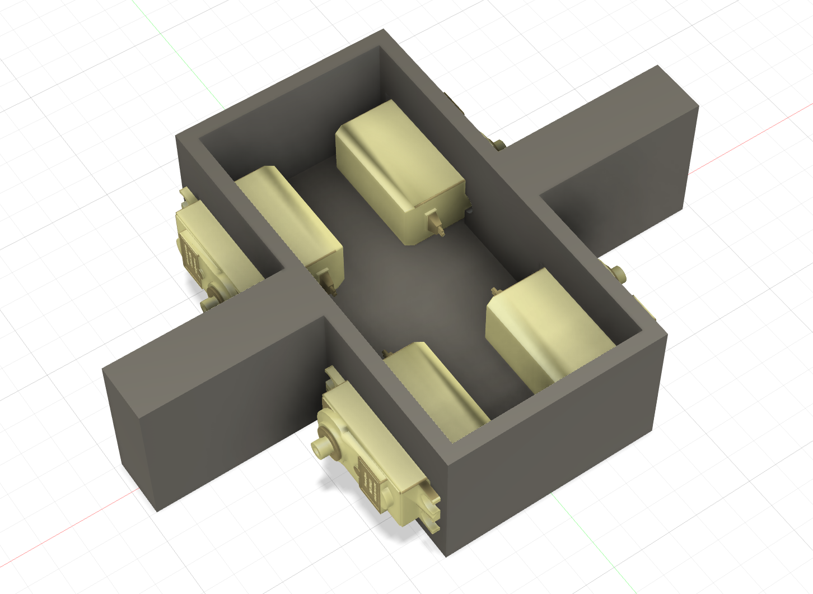
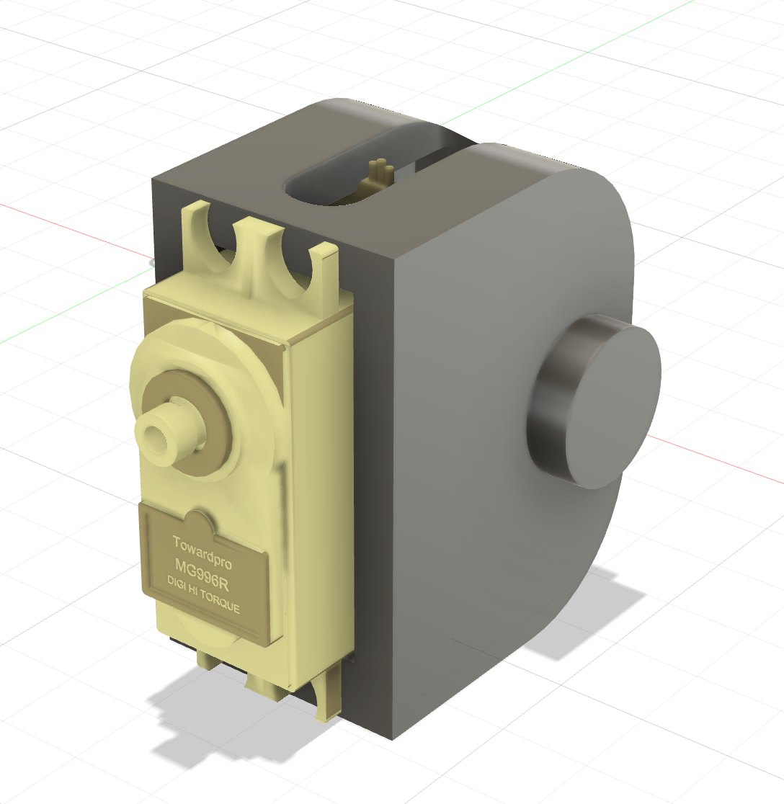
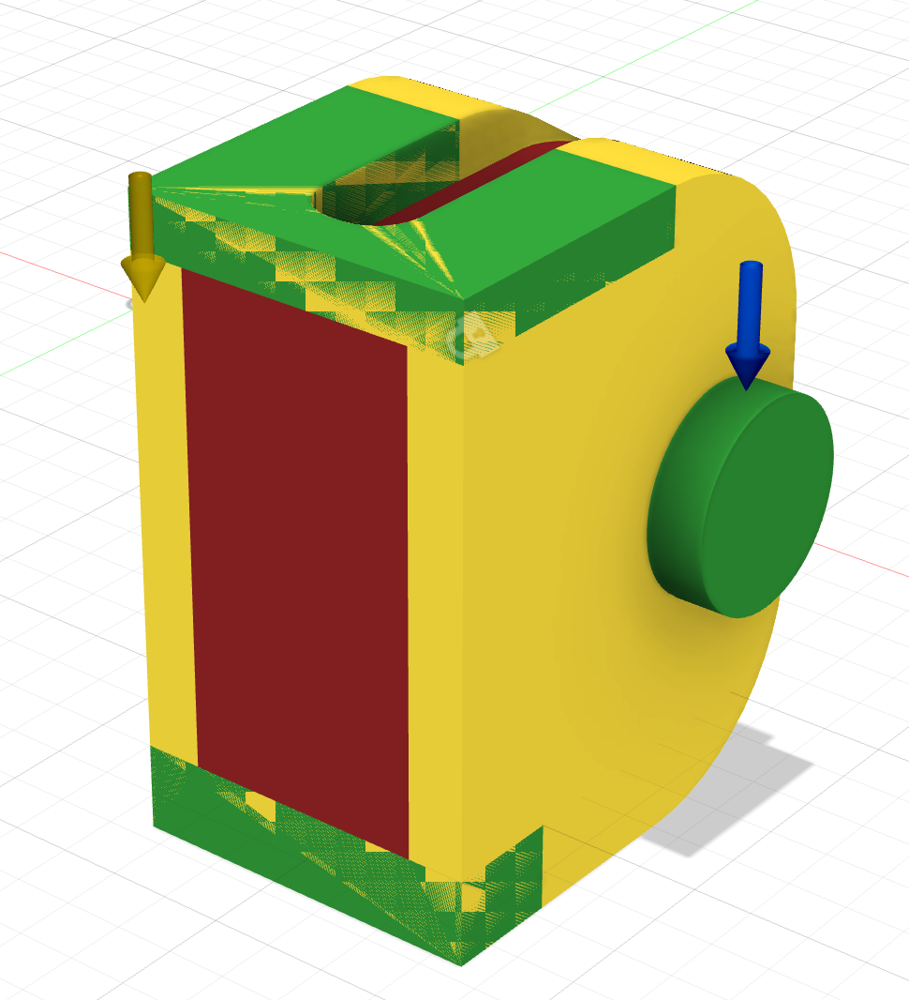
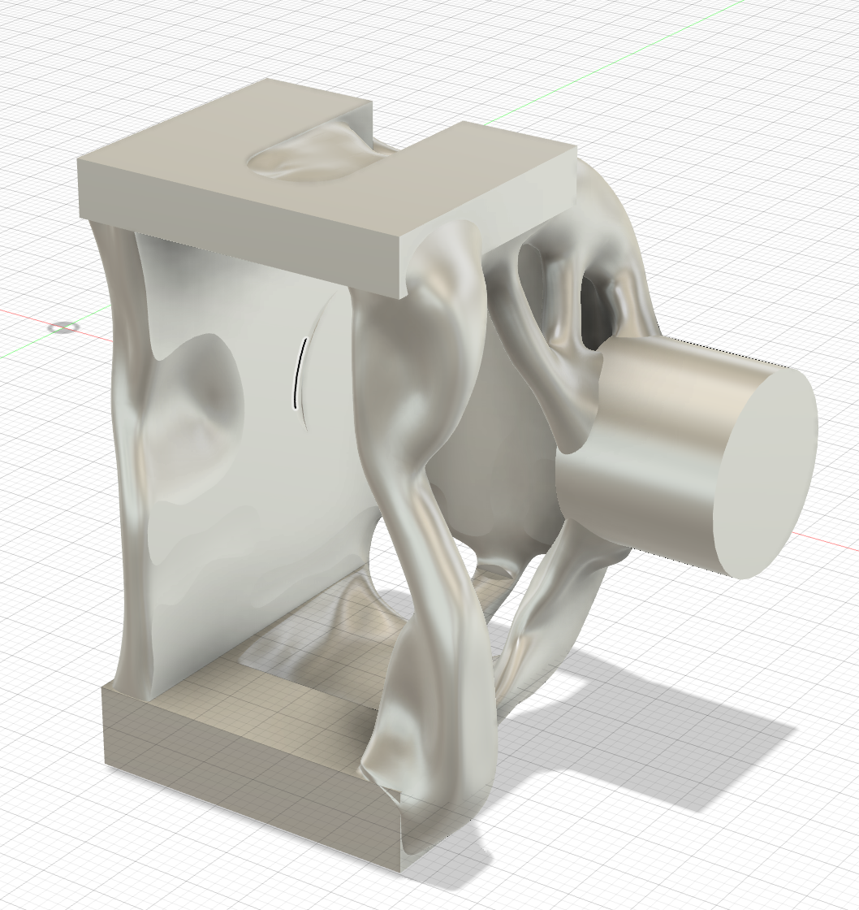
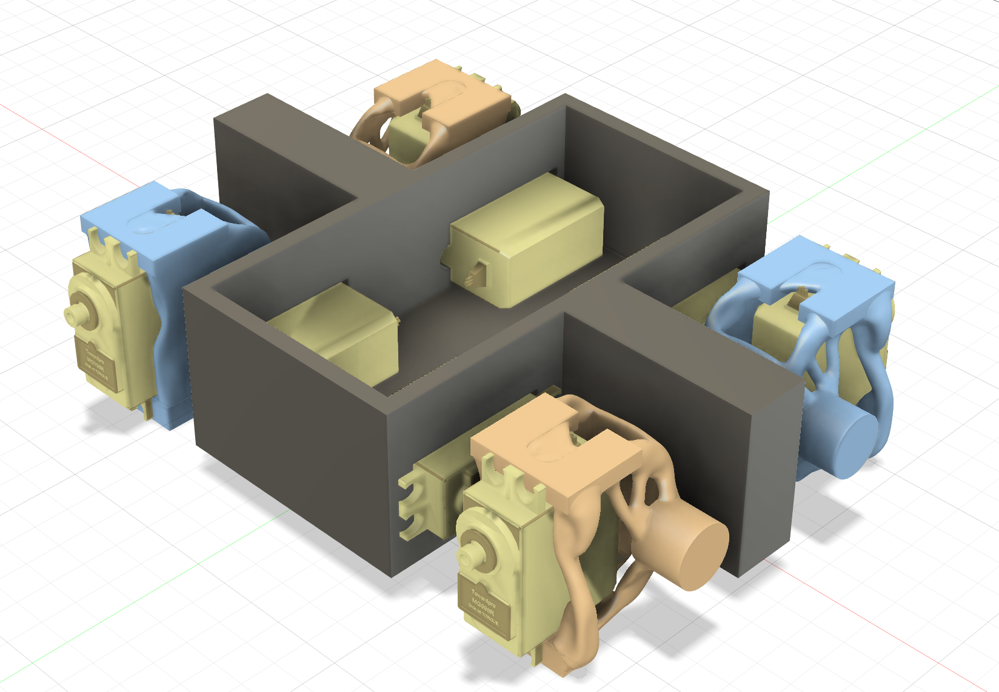
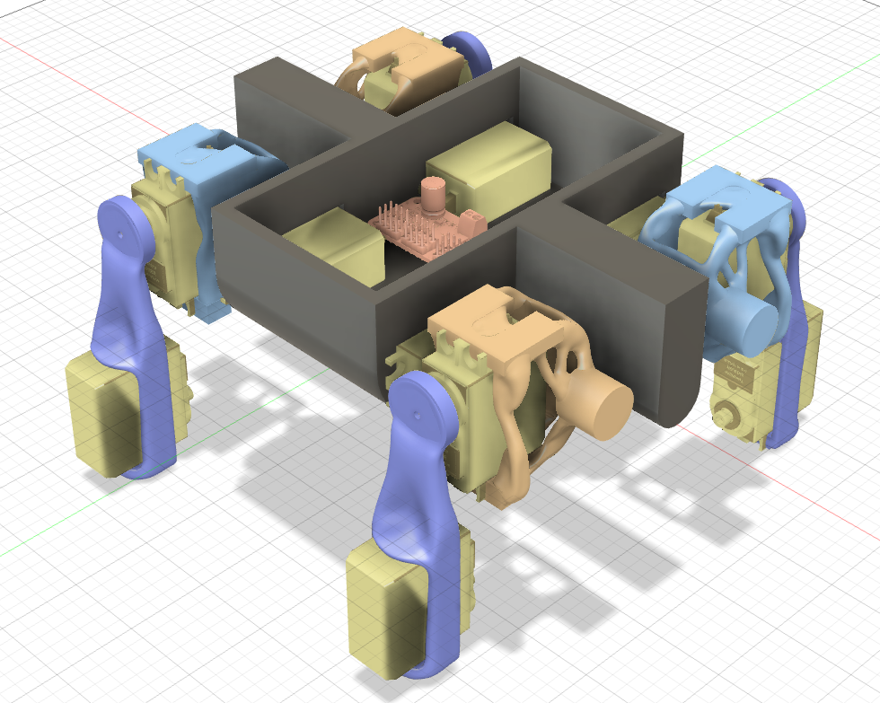
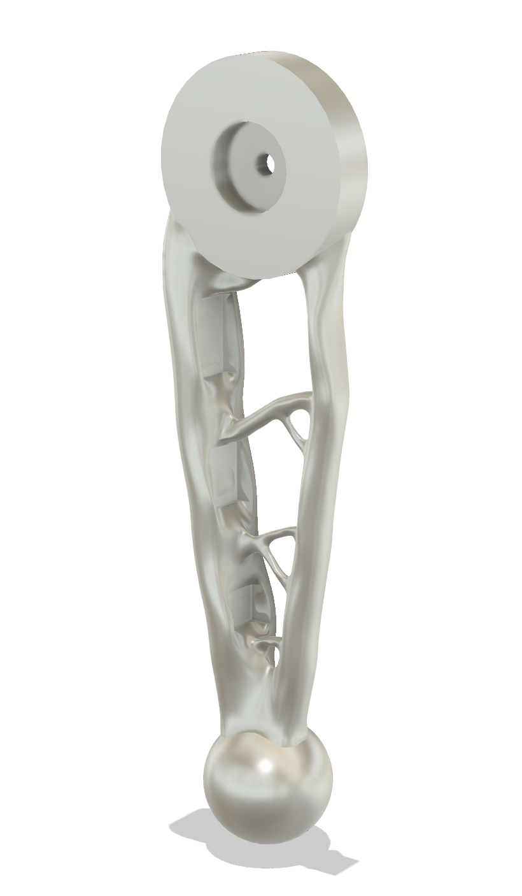
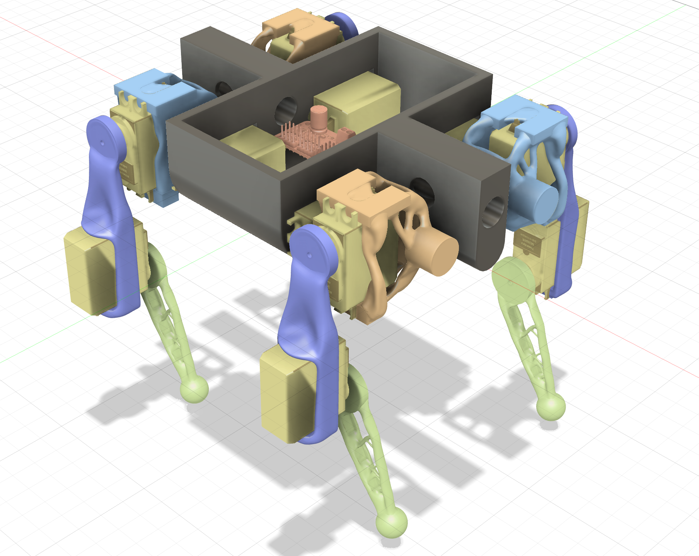

## Total Time Spent: ~20 hours   

### July 1st
Time Spent: ~3 hours  

Today I spent around 3 hours finalizing the electronics setup for the quadruped. I worked through the voltage and current requirements for all 12 servos, made sure the ESP32 would get clean power, and mapped out how everything would be connected. After a lot of calculations and comparing specs, I landed on a 2S LiPo battery, a 5V 10A buck converter, and a PCA9685 PWM driver to handle the servo control. This setup ensures that each servo will get appropriate power. I will need 12 MG996R servos, as they are high torque, allow angle setting, and also affordable.  Next, I aim to make a CAD design for the quadruped that is built around these components. 

### July 2nd
Time Spent: ~4 hours

Today I spent around 4 hours constructing the central enclosure for the quadruped. This was particularly challenging because I had to design it with the constraints of the motors and circuitry, maintaining enough space for all the components but also staying lightweight. I found an online model of the MG996R servos, which was particularly helpful when designing the enclosure rather than just using numerical measurements. I also planned servo placement; the 4 servos shown below serve as hips. I will have 4 more servos serving as rotation points for the leg, and 4 others serving as knee joints. Hopefully the servos have enough power to sustain this load. 

### July 3rd
Time Spent: ~5 hours

Today I spent around 5 hours designing the leg brace for the leg motor joints. This was especially time consuming because I learned to use a new tool: Fusion's Generative Design Tool. I first made a rough enclosure for the motor. This part was pretty easy. Then, I watched a tutorial on the generative design feature in Fusion. After watching it, I set the Preserve Geometry, Obstacle Geometry, and the Starting Shape. I ran several iterations of the Generative Design. After around 3 hours, I finally generated this really cool design that reduced weight while remaining structurally sound. I am really glad that I learned this new skill and will continue to use it on this project. 

### July 6th
Time Spent: ~2 hours

Today I spent 2 hours designing the knee brace for the knee motor joints. This was much faster than last time because I had much more knowledge and experience with the Generative Design Tool. However, I had to run more simulations this time because it kept converging to a result that would result in too much structural strain. After I generated a design I was happy with, I assembled it all together. 

### July 8th
Time Spent: ~6 hours

Today I spent 6 hours designing the final joint for the legs. This took a considerable amount of time because I had to experiment a lot with obstacle conditions to provide a joint that was structurally sound. This joint is probably the one that needs the most structural integrity because it will carry all the weight from the quadruped and also be the joints that are walked on. In the end, I am really proud of how the result looks; I hope that it is also strong in real life. 

