## Total Time Spent: ~35 hours   

### July 1st
Time Spent: ~3 hours  

Today I spent around 3 hours finalizing the electronics setup for the quadruped. I worked through the voltage and current requirements for all 12 servos, made sure the ESP32 would get clean power, and mapped out how everything would be connected. After a lot of calculations and comparing specs, I landed on a 2S LiPo battery, a 5V 10A buck converter, and a PCA9685 PWM driver to handle the servo control. This setup ensures that each servo will get appropriate power. I will need 12 MG996R servos, as they are high torque, allow angle setting, and also affordable.  Next, I aim to make a CAD design for the quadruped that is built around these components. 

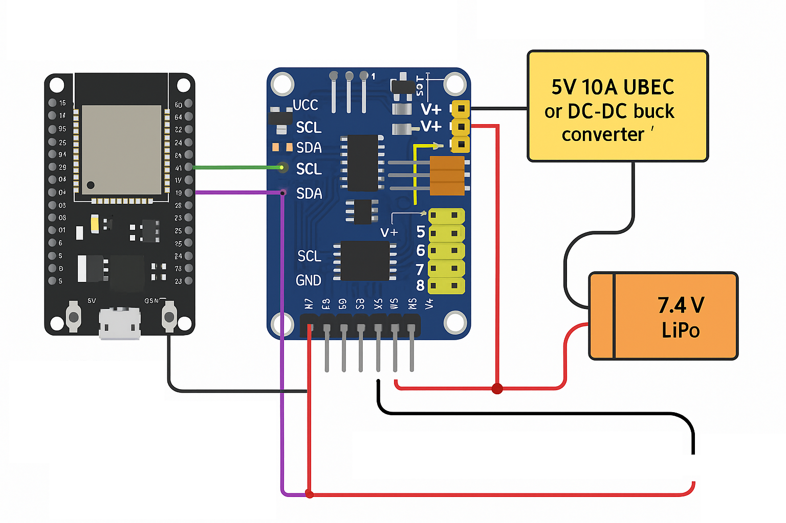

### July 2nd
Time Spent: ~4 hours

Today I spent around 4 hours constructing the central enclosure for the quadruped. This was particularly challenging because I had to design it with the constraints of the motors and circuitry, maintaining enough space for all the components but also staying lightweight. I found an online model of the MG996R servos, which was particularly helpful when designing the enclosure rather than just using numerical measurements. I also planned servo placement; the 4 servos shown below serve as hips. I will have 4 more servos serving as rotation points for the leg, and 4 others serving as knee joints. Hopefully the servos have enough power to sustain this load. 

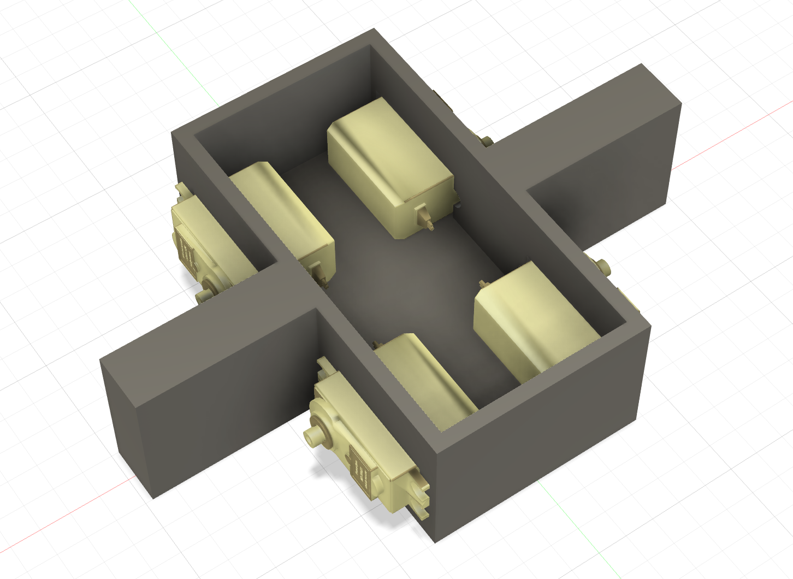

### July 3rd
Time Spent: ~5 hours

Today I spent around 5 hours designing the leg brace for the leg motor joints. This was especially time consuming because I learned to use a new tool: Fusion's Generative Design Tool. I first made a rough enclosure for the motor. This part was pretty easy. Then, I watched a tutorial on the generative design feature in Fusion. After watching it, I set the Preserve Geometry, Obstacle Geometry, and the Starting Shape. I ran several iterations of the Generative Design. After around 3 hours, I finally generated this really cool design that reduced weight while remaining structurally sound. I am really glad that I learned this new skill and will continue to use it on this project. 

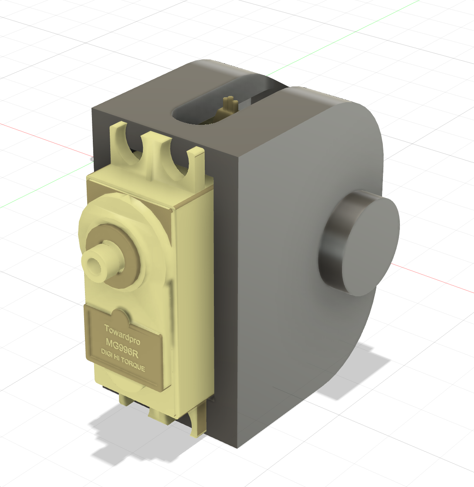
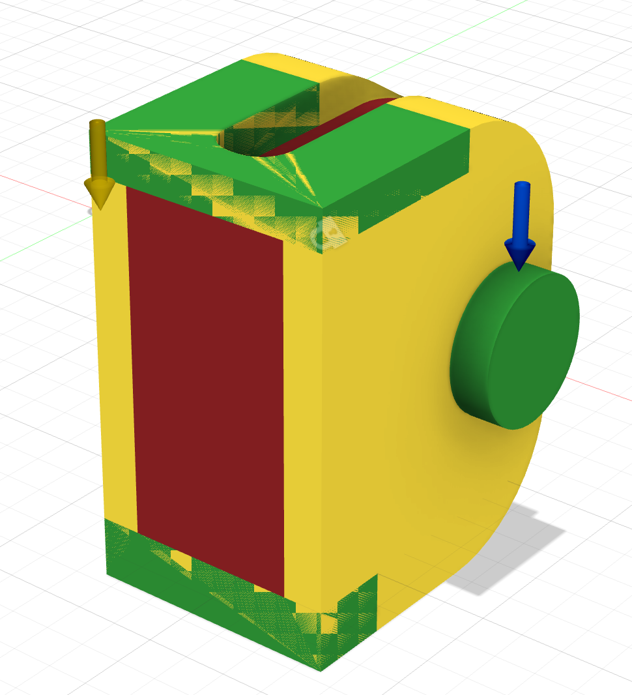
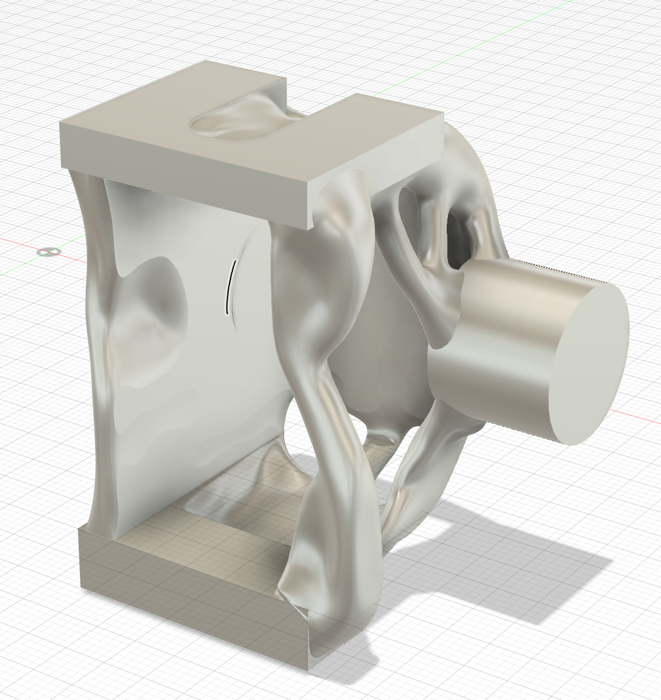
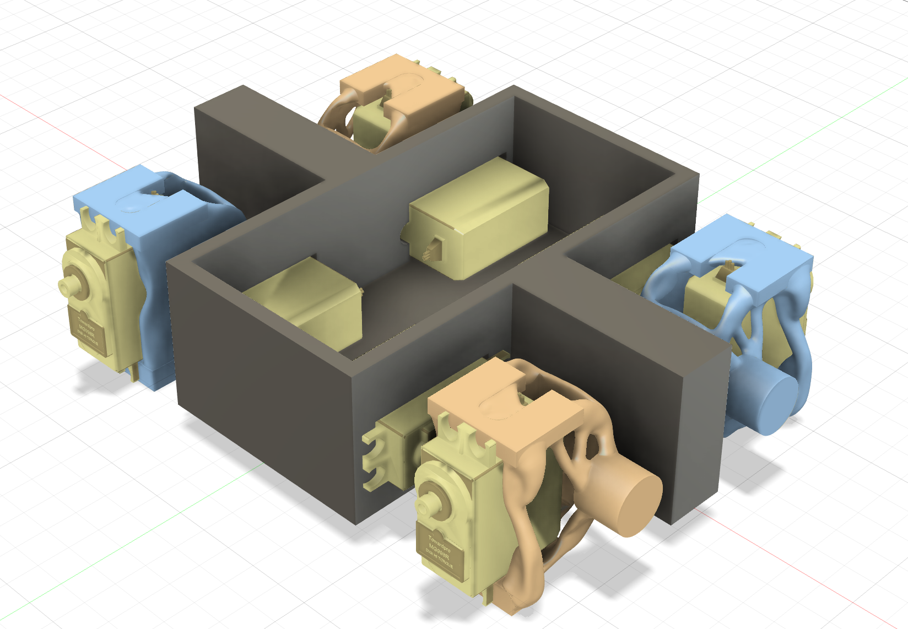

### July 6th
Time Spent: ~2 hours

Today I spent 2 hours designing the knee brace for the knee motor joints. This was much faster than last time because I had much more knowledge and experience with the Generative Design Tool. However, I had to run more simulations this time because it kept converging to a result that would result in too much structural strain. After I generated a design I was happy with, I assembled it all together. 

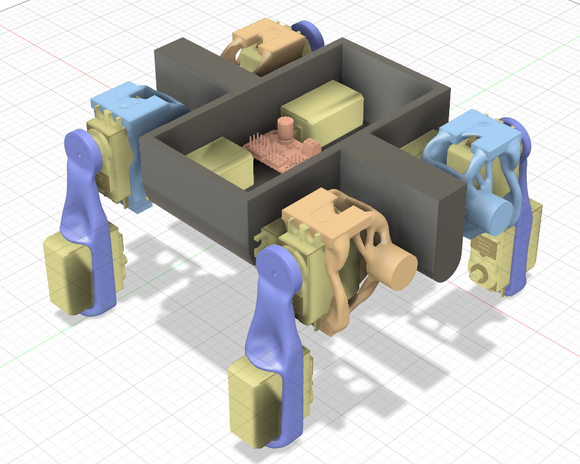

### July 8th
Time Spent: ~6 hours

Today I spent 6 hours designing the final joint for the legs. This took a considerable amount of time because I had to experiment a lot with obstacle conditions to provide a joint that was structurally sound. This joint is probably the one that needs the most structural integrity because it will carry all the weight from the quadruped and also be the joints that are walked on. In the end, I am really proud of how the result looks; I hope that it is also strong in real life. 

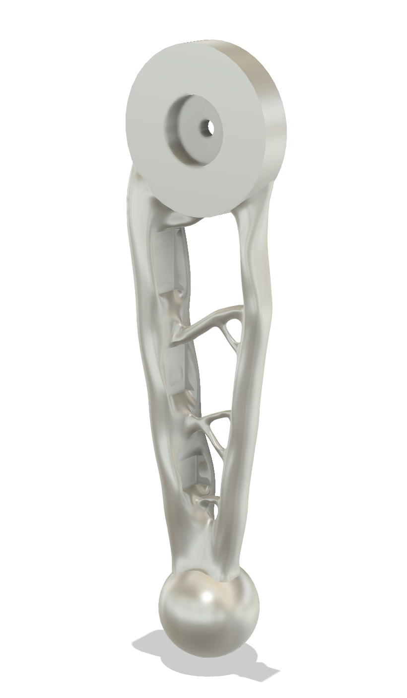
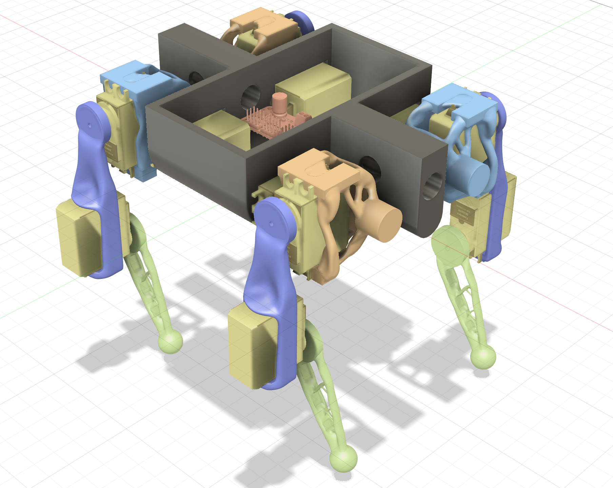

### July 29th 
Time Spent: ~4 hours

Following Ducc's advice on redesigning the parts on my own, today I spent some time redesigning the joints for the quadruped. The hardest part was minimizing the bulk and mass without generative design. I did so by running stress tests on each part, looking for particular areas that were extremely low in stress and were surrounded by low stressed areas, and removing them. Another challenge was making mounts for the screwholes and motor attachments. Since I don't have the motors in hand and their mounts, I made some approximations that I will fine tune once the motors arrive. 

I was particularly proud of the last leg joint. To add the spherical bottom that I have seen in many other prototypes, I used a Fusion form instead of the standard solids. Because of this method, I am now more comfortable with using Forms and have learned a new skill that I will definitely use in other projects. I then joined the form and solid to make a single unified part. Then, I used the Von Mises stress test to make some remove extrusions in areas that were particularly low in stress. 

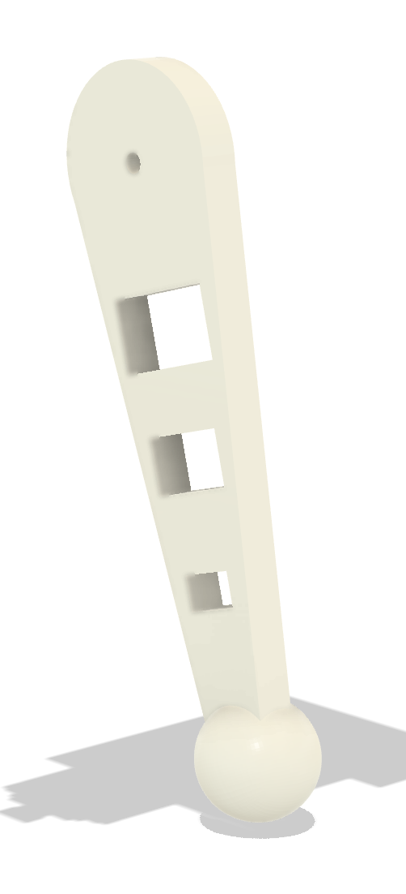

# July 30th 
Time Spent: ~3 hours

Today I redesigned the hip brace joint. First, I used my existing measurement of the motors as a guiding box that I had to build around for the part. I did this by first make a cube for the motor section. Then, I built around it by make sketch faces on the cube so that I could build around it. I found that this method was much harder becase filleting and having a fluid design between the faces was much harder to acheive, so I decided to first design the part and then use a remove extrusion for the motor section. I first made a basic cube design, and then filleted the back side so that there would be a larger range of motion for the joint. Then, I cut the whole for the motor, and also made another hole at the top to accomodate for the motor wires that generally stick out around 2 mm. Finally, I thickened the portions at the top and bottom of the motor slot so that I could screw the motor in. I was really happy with my progress today.  

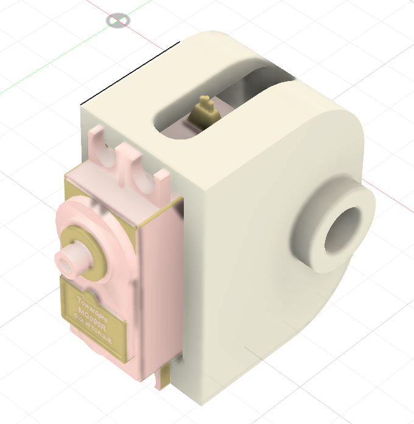

# July 31st
Time Spent: ~3 hours

Today I made the central leg joint. Today was a much faster process because of the experiences and knowledge I had gained from yesterday and the day before. I started by make a log rectangular shape with a circle at the end for the leg. I didn't want it to be too long, as it would increase the moment of inertia and thus the torque required by the motor. Then, I extruded the bottom of the motor so that I could make a hole for the motor. Then, I followed yesterdays steps and thickened the tops and bottoms of the motor holes, both vertically and horizontally so that I could use screws. Finally, I made an arch between the top circular portion and the motor casing so that the design was more seamless. 

Then, I assembled the whole thing into one file. This was time consuming at first, but I realized that I could just use reflections and rotations instead of copy-pasting and dragging, rotating, etc. When I finally assembled the whole thing, I was satisfied with the result and actually preferred the design to the AI one. I did some rendering and was finally completed. 

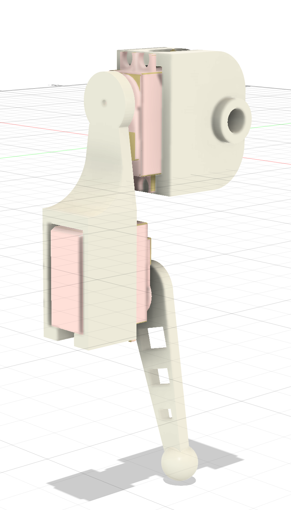
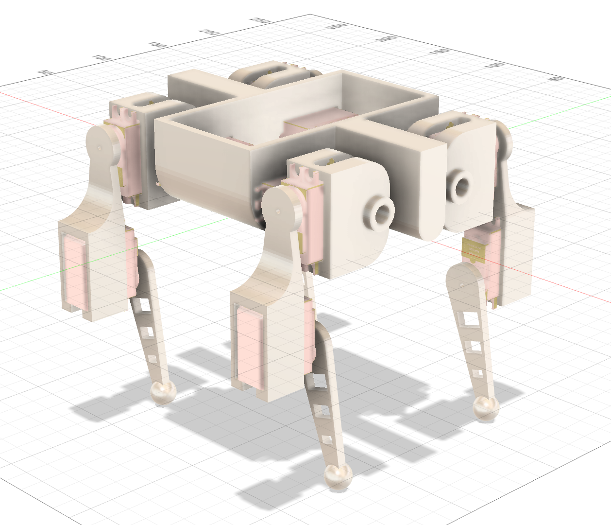

# August 8th
Time Spent: ~2 hours

Today I made my own inverse kinematics code for the quadruped's leg movements. To do so, I started off on paper and geometrically understood the point of inverse kinematics. It aims to find joint angles to get to a desired position (x,y). Using the law of cosines, I solved for the first angle, and based off of that angle, I solved for the second angle using the law of sines. It was really interesting seeing how the stuff we learnt in school was actually very useful in application. Then, to visualize the results, I tried inputting the results into desmos so that I could manipulate the desired position (x,y) and see the resulting joint angles visualized. This was much more challenging because I found out that arcsin is limited to the range of [-pi/2, pi/2], so I decided to use another approach that I found online using arctan2. Using this, I recreated my calculation system. I got the angles correct, and to connect the two "joints", I parameterized the vector and made sure to add the old vectors position as constants to make sure that they looked connected. It was a very long and arduous process, but I am happy I got it done; I now have my code basically layed out for me, and figuring it out on my own was especially rewarding. 

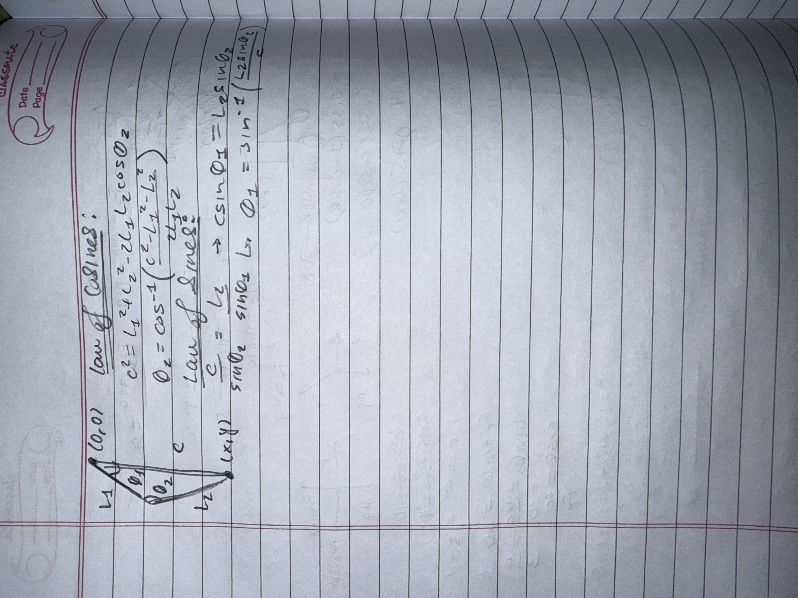
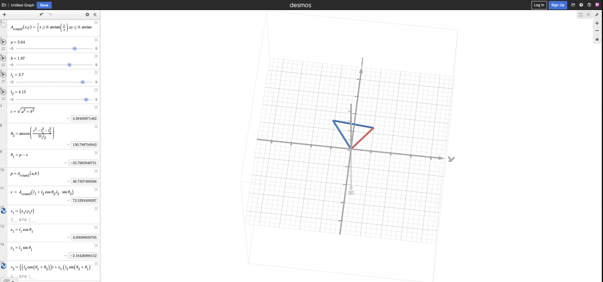

# August 9th
Time Spent: ~3 hours

Today I tried implementing the inverse kinematics math I did in code. This was pretty easy as all I had to do was rewrite the desmos code in C++'s syntax and wrap it in a method / function. Next, I tried to figure out the IMU logic. I had used an IMU before, but it was mainly for determining rotation in the XY Plane and not much beyond that. I looked at adafruit's documentation to understand more about it and wrote a method to extract values from  it. Then, I moved on to understanding how the PCA9685 works. This required me to code a method that converted the degree output from the inverseKinematics() function into Pulse Width Modulation signals. I wrote the method, but will have to calibrate it according to my motors when I receive them. Then, I wrote a basic function for leg movement, utelizing the inverseKinematics() and degreesToPulse() functions. Finally, I wrapped a sequence of leg movement functions in the walk() function, which I call in void loop. I will require a lot of fine tuning of the hyperparameters like l1, l2, and the motor ranges, but that will be easy once I receive the parts. I am really happy with my progress today because I was dreading the coding part, and am happy I got it over with. Now, hopefully my project is ready to be approved. 

