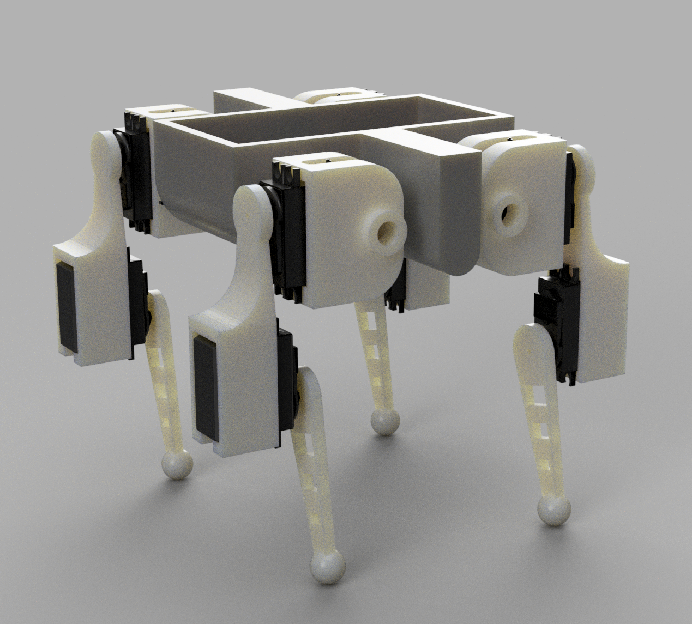
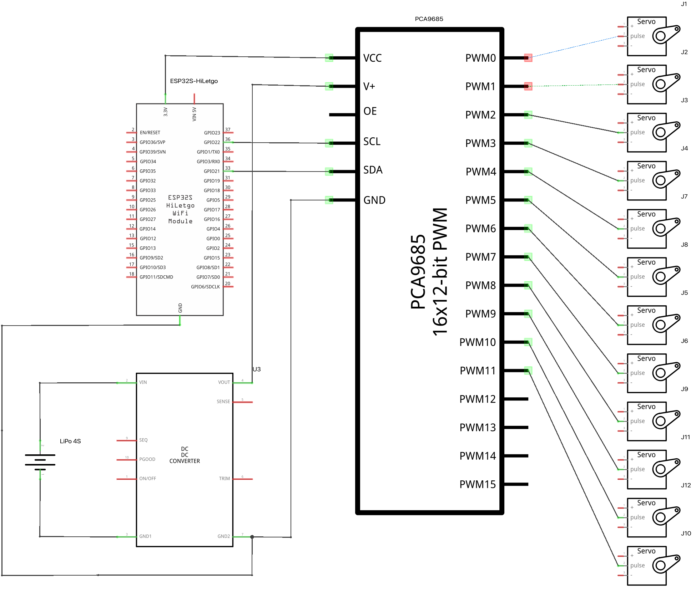

# Quadruped Robot

### Project Description

This is a smart quadruped robot dog that imitates the Boston Dynamics robot Spot. It uses inverse kinematics logic, along with visual input through cameras and quantitive measurements through an IMU to inform it's walking and movement algorithmns. 

### Why we made it

We set out to build a quadruped robot to better understand how complex systems like locomotion, balance, and perception work together in robotics. This project gave us the opportunity to apply concepts like inverse kinematics, sensor integration, and real-time control in a hands-on way. Building a walking robot also pushed us to think carefully about both mechanical design and software logic.

## Fully Assembled Prototype 

## Rendered Prototype 

## Circuit 

## Bill of Materials (BOM)

| Component                           | Quantity | Price Estimate | Link |
|-------------------------------------|----------|----------------|------|
| MG996R Motors                       | 12        | $54        | [Amazon](https://www.amazon.com/6-Pack-MG996R-Torque-Digital-Helicopter/dp/B07MFK266B/ref=asc_df_B0BMM1G74B?mcid=895b588916e63ac8979880c805978872&hvocijid=14981104030393967827-B0BMM1G74B-&hvexpln=73&tag=hyprod-20&linkCode=df0&hvadid=721245378154&hvpos=&hvnetw=g&hvrand=14981104030393967827&hvpone=&hvptwo=&hvqmt=&hvdev=c&hvdvcmdl=&hvlocint=&hvlocphy=9007587&hvtargid=pla-2281435179018&th=1) |
| PCA9685 (x2 is cheaper)                             | 1        | $14            | [Amazon](https://www.amazon.com/HiLetgo-PCA9685-Channel-12-Bit-Arduino/dp/B07BRS249H/ref=sr_1_1_sspa?crid=23PBH9MR11NR3&dib=eyJ2IjoiMSJ9.K8E8lR6SJTCT20R4w3dp2WKv3ytACOiSBWQcGH08smWSlCXtz7XgDCyFnZ_gcVe2dEEXjvic6CCSOO1kHDambBWjUWGrWIJYlO6f_m79qbhOEXqG0aLm66LBFJZUTy0OFIgKEa4aObNYtcLky7pP3za-gu2NZNPvBzu8Bj4k4uOx-WY5QeQicOVYAY-MnuEOHaEKGRaoBpRu4Tk-Dt6G6qyFgM7wjFg3VPR9VA-Cx2M.YYJRKkS-cEUj1t-PUgqbqWOas5KVWs-Q6icrg3tflYc&dib_tag=se&keywords=PCA9685&qid=1752531396&s=toys-and-games&sprefix=pca9685%2Ctoys-and-games%2C108&sr=1-1-spons&sp_csd=d2lkZ2V0TmFtZT1zcF9hdGY&psc=1) |
| 12V to 5V Voltage Transformer       | 1        | $10             | [Amazon](https://www.amazon.com/VOLRANTISE-Converter-Voltage-Regulator-Transformer/dp/B09WZ9DC9W/ref=sr_1_1_sspa?crid=1H72N4HAQF4TO&dib=eyJ2IjoiMSJ9.6_PEK-XO0rSnnr_wx3-z-oRYOH9WR49jl9Xul-m4QfPEHbvHl5swrXt5uwW98O5imOETmMBVh3Pex7x_IPD5OeCgKrK_IgI5YbCKmpib4ToQs7U-vwr5QP0zQvNNkVHmaVq8dB1tXs_yqnsRubKGyyq-Gme4_lDAXixsHlRKAkO2UKzpYGns-xeLhFgWfMg3eS99veSm9a9Dv6fpy2KTrCSAmEEOmZdQxFAbJ5pR5fQ.4xJDbfwcJAoW4umYmHvj8vvVMw5hBgy5NnmDEC9v6pA&dib_tag=se&keywords=DC%2B12V%2F24V%2Bto%2B5V%2B10A%2BConverter%2B-%2BVoltage%2BRegulator%2BStep%2BDown%2BBuck%2BConverter%2BPower%2BSupply%2BTransformer%2B(12V%2F24V%2Bto%2B5V%2B10A)&qid=1752709920&sprefix=dc%2B12v%2F24v%2Bto%2B5v%2B10a%2Bconverter%2B-%2Bvoltage%2Bregulator%2Bstep%2Bdown%2Bbuck%2Bconverter%2Bpower%2Bsupply%2Btransformer%2B12v%2F24v%2Bto%2B5v%2B10a%2B%2Caps%2C57&sr=8-1-spons&sp_csd=d2lkZ2V0TmFtZT1zcF9hdGY&th=1)|
| Total                        | 14               | $78             | N/A |

